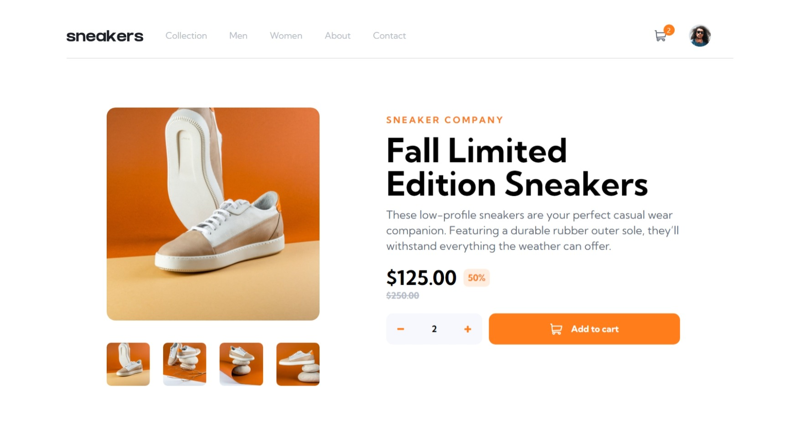
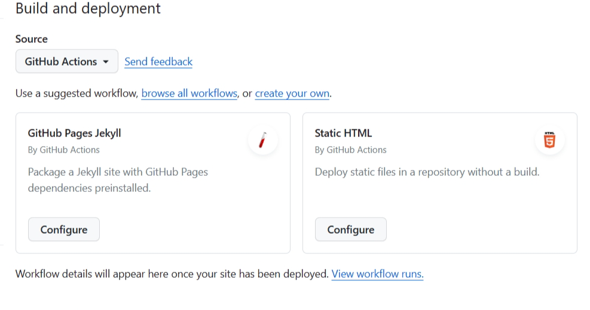
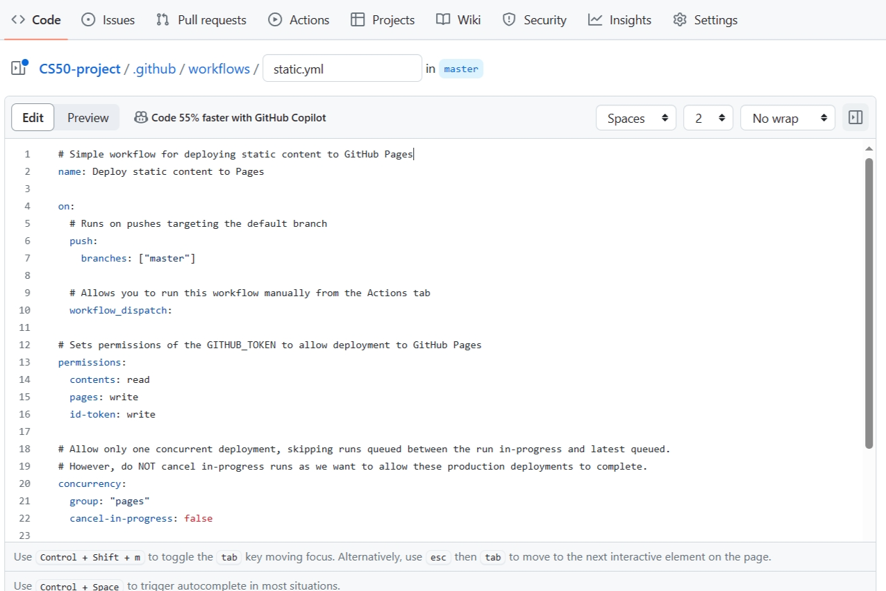

# Frontend Mentor - E-commerce product page solution

This is a solution to the [E-commerce product page challenge on Frontend Mentor](https://www.frontendmentor.io/challenges/ecommerce-product-page-UPsZ9MJp6). Frontend Mentor challenges help you improve your coding skills by building realistic projects.

## Table of contents

- [Overview](#overview)
  - [The challenge](#the-challenge)
  - [Screenshot](#screenshot)
  - [Links](#links)
- [My process](#my-process)
  - [Built with](#built-with)
  - [What I learned](#what-i-learned)
  - [Continued development](#continued-development)
  - [Useful resources](#useful-resources)
- [Author](#author)
- [Acknowledgments](#acknowledgments)

**Note: Delete this note and update the table of contents based on what sections you keep.**

## Overview

### The challenge

Users should be able to:

- View the optimal layout for the site depending on their device's screen size
- See hover states for all interactive elements on the page
- Open a lightbox gallery by clicking on the large product image
- Switch the large product image by clicking on the small thumbnail images
- Add items to the cart
- View the cart and remove items from it

### Screenshot




### Links

- Solution URL: [Github](https://github.com/atikahnaz/ecommerce-product-page-main)
- Live Site URL: [Ecommerce Page](https://atikahnaz.github.io/ecommerce-product-page-main/)

## My process

### Built with

- Semantic HTML5 markup
- Mobile-first workflow
- [React](https://reactjs.org/) - JS library
- Tailwind
- Vite

### What I learned

**1. Image Slideshow**

Images located inside public folder(not process by webpack). (if src/images, the images can be used using import, require() or import js file(eg. src/images/index.js))

- Create JSON file(src/images.json)

**2. Updating cart**

using callback function to pass data

```jsx
function App() {
const updateCart = (total) => {
  setQuantity(total);
};
}

return (
<InfoItem callbackUpdateCart={updateCart} />;
)
```

```jsx
function InfoItem({ callbackUpdateCart }) {
  return <PriceItem callback={callbackUpdateCart} />;
}
```

```jsx
function PriceItem({ callback }) {
  return (
  <div className="flex items-center justify-center bg-FEOrange py-4 rounded-xl"
        onClick={() => {
          callback(quantity);
        }}
      >)
}
```

**3. Remove item**

```jsx
function App() {
  const deleteItem = () => {
    setQuantity(0);
  };
}

return <NavBar item={item} toRemove={deleteItem} />;
```

```jsx
function NavBar({ item, toRemove }) {
  return (
    
  );
}
```

**4. Importing Images**

- images are located inside src/images folder and ImagePreview.jsx inside src/components.

```jsx
import IconNext from "../images/icon-next.svg";
```

**5. Deploy React + Vite to Github**

- Set the correct base in vite.config.js.

If you are deploying to https://<USERNAME>.github.io/, or to a custom domain through GitHub Pages (eg. www.example.com), set base to '/'. Alternatively, you can remove base from the configuration, as it defaults to '/'.

If you are deploying to https://<USERNAME>.github.io/<REPO>/ (eg. your repository is at https://github.com/<USERNAME>/<REPO>), then set base to '/<REPO>/'.

- Go to your GitHub Pages configuration in the repository settings page and choose the source of deployment as "GitHub Actions", this will lead you to create a workflow that builds and deploys your project, a sample workflow that installs dependencies and builds using npm is provided:
  

- Copy this code inside static.yml

```.yml
  # Simple workflow for deploying static content to GitHub Pages
  name: Deploy static content to Pages


on:

# Runs on pushes targeting the default branch

push:
branches: ['main']

# Allows you to run this workflow manually from the Actions tab

workflow_dispatch:

# Sets the GITHUB_TOKEN permissions to allow deployment to GitHub Pages

permissions:
contents: read
pages: write
id-token: write

# Allow one concurrent deployment

concurrency:
group: 'pages'
cancel-in-progress: true

jobs:

# Single deploy job since we're just deploying

deploy:
environment:
name: github-pages
url: ${{ steps.deployment.outputs.page_url }}
runs-on: ubuntu-latest
steps: - name: Checkout
uses: actions/checkout@v4 - name: Set up Node
uses: actions/setup-node@v3
with:
node-version: 18
cache: 'npm' - name: Install dependencies
run: npm install - name: Build
run: npm run build - name: Setup Pages
uses: actions/configure-pages@v3 - name: Upload artifact
uses: actions/upload-pages-artifact@v2
with: # Upload dist repository
path: './dist' - name: Deploy to GitHub Pages
id: deployment
uses: actions/deploy-pages@v2

```



### Useful resources

- [Deploying Static Site](https://vitejs.dev/guide/static-deploy.html)

## Author

- Frontend Mentor - [@atikahnaz](https://www.frontendmentor.io/profile/atikahnaz)
